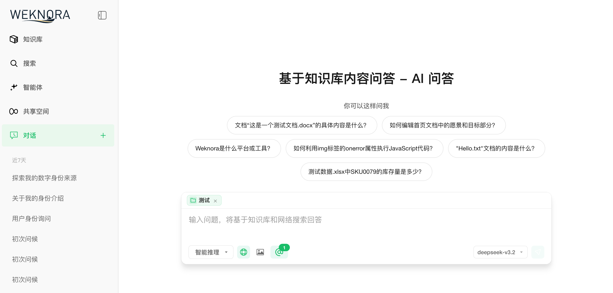
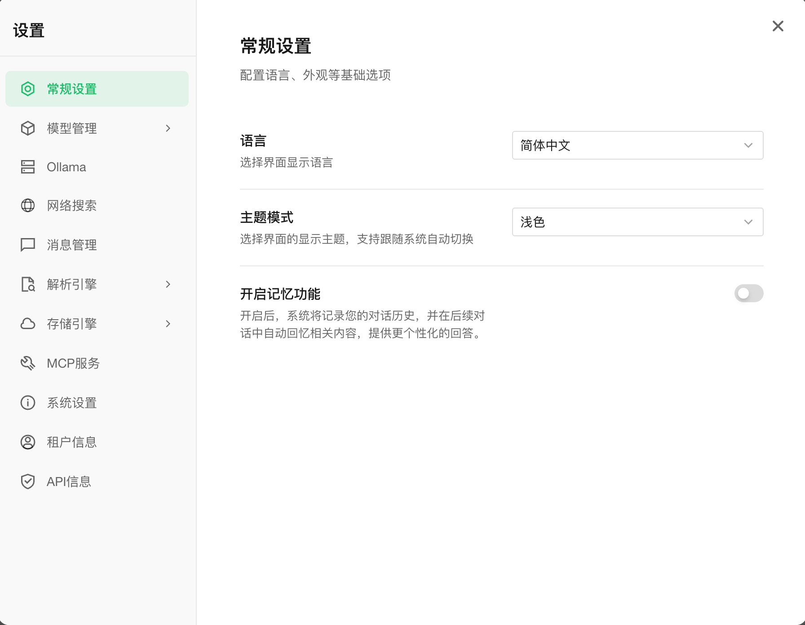

<p align="center">
  <picture>
    
  </picture>
</p>

<p align="center">
  <picture>
    <a href="https://trendshift.io/repositories/15289" target="_blank">
      
    </a>
  </picture>
</p>
<p align="center">
    <a href="https://weknora.weixin.qq.com" target="_blank">
        
    </a>
    <a href="https://chatbot.weixin.qq.com" target="_blank">
        
    </a>
    <a href="https://github.com/Tencent/WeKnora/blob/main/LICENSE">
        
    </a>
    <a href="./CHANGELOG.md">
        
    </a>
</p>

<p align="center">
| <a href="./README.md"><b>English</b></a> | <a href="./README_CN.md"><b>简体中文</b></a> | <a href="./README_JA.md"><b>日本語</b></a> | <b>한국어</b> |
</p>

<p align="center">
  <h4 align="center">

  [개요](#-개요) • [아키텍처](#️-아키텍처) • [핵심 기능](#-핵심-기능) • [시작하기](#-시작하기) • [API 레퍼런스](#-api-레퍼런스) • [개발자 가이드](#-개발자-가이드)

  </h4>
</p>

# 💡 WeKnora - LLM 기반 문서 이해 및 검색 프레임워크

## 📌 개요

[**WeKnora**](https://weknora.weixin.qq.com)는 엔터프라이즈급 문서 이해와 시맨틱 검색을 위해 설계된, LLM 기반의 지능형 지식 관리 및 Q&A 프레임워크입니다.

WeKnora는 **빠른 Q&A**와 **지능형 추론** 두 가지 Q&A 모드를 제공합니다. 빠른 Q&A는 **RAG(Retrieval-Augmented Generation)** 파이프라인으로 관련 조각을 빠르게 검색하여 답변을 생성하며, 일상적인 지식 검색에 적합합니다. 지능형 추론은 **ReACT Agent** 엔진이 **점진적 전략**으로 지식 검색, MCP 도구, 웹 검색을 자율적으로 오케스트레이션하며, 반복 추론과 리플렉션을 통해 단계적으로 결론을 도출합니다. 다중 소스 통합과 복잡한 작업에 적합합니다. 커스텀 에이전트도 지원하여 전용 지식베이스, 도구 세트, 시스템 프롬프트를 유연하게 구성할 수 있습니다. 용도에 맞게 모드를 선택하여 응답 속도와 추론 깊이를 동시에 달성합니다.

Feishu 등 외부 플랫폼에서 지식 자동 동기화를 지원하며(추가 데이터 소스 개발 중), PDF, Word, 이미지, Excel 등 10가지 이상의 문서 포맷을 처리합니다. WeChat Work, Feishu, Slack, Telegram 등의 IM 채널을 통해 Q&A 서비스를 직접 제공할 수 있습니다. 모델 레이어에서 OpenAI, DeepSeek, Qwen(Alibaba Cloud), Zhipu, Hunyuan, Gemini, MiniMax, NVIDIA, Ollama 등 주요 프로바이더를 지원합니다. 전체 프로세스가 모듈화 설계되어 LLM, 벡터 DB, 스토리지 등 구성 요소를 유연하게 교체 가능하며, 로컬 및 프라이빗 클라우드 배포를 지원하여 데이터 완전 자체 관리가 가능합니다.

**웹사이트:** https://weknora.weixin.qq.com

## ✨ 최신 업데이트

**v0.3.6 하이라이트:**

- **ASR(자동 음성 인식)**: ASR 모델 통합으로 오디오 파일 업로드, 문서 내 오디오 미리보기, 음성 전사 기능 지원
- **데이터 소스 자동 동기화(Feishu)**: 완전한 데이터 소스 관리 기능, Feishu Wiki/드라이브 자동 동기화(증분/전체), 동기화 로그 및 테넌트 격리
- **OIDC 인증**: OpenID Connect 로그인 지원, 자동 디스커버리, 커스텀 엔드포인트 설정, 사용자 정보 매핑
- **IM 인용 답장 컨텍스트**: IM 채널에서 인용 메시지를 추출해 LLM 프롬프트에 주입하여 맥락 기반 답변 실현; 비텍스트 인용의 환각 방지 처리
- **IM 스레드 기반 세션**: IM 채널(Slack, Mattermost, Feishu, Telegram)에서 스레드 단위 세션 모드를 지원, 스레드 내 다중 사용자 협업
- **문서 자동 요약**: AI 생성 문서 요약, 최대 입력 크기 설정 가능, 문서 상세 페이지에 전용 요약 섹션
- **Tavily 웹 검색**: Tavily를 새로운 웹 검색 프로바이더로 추가; 웹 검색 프로바이더 아키텍처를 확장성 향상을 위해 리팩토링
- **MCP 자동 재연결**: 서버 연결 끊김 시 MCP 도구 호출 자동 재연결 로직
- **병렬 도구 호출**: Agent 모드에서 errgroup을 사용한 다중 도구 호출 병렬 실행으로 복잡한 작업 처리 속도 향상
- **Agent @멘션 범위 제한**: 사용자 @멘션을 Agent 허용 지식베이스 범위로 제한하여 무단 접근 방지
- **로그인 페이지 성능**: backdrop-filter blur 전체 제거, 애니메이션 요소 축소, GPU 합성 힌트 추가

**v0.3.5 하이라이트:**

- **Telegram, DingTalk & Mattermost IM 통합**: Telegram 봇(webhook/롱폴링, editMessageText 스트리밍), DingTalk 봇(webhook/Stream 모드, AI 카드 스트리밍), Mattermost 어댑터를 신규 추가. IM 채널이 기업WeChat, Feishu, Slack, Telegram, DingTalk, Mattermost 6개 플랫폼으로 확대
- **IM 슬래시 커맨드 및 QA 큐**: 플러그인 방식 슬래시 커맨드 프레임워크(/help, /info, /search, /stop, /clear), 유계 QA 워커 풀, 사용자별 레이트 리밋, Redis 기반 멀티 인스턴스 분산 조정
- **추천 질문**: Agent가 연결된 지식베이스를 기반으로 컨텍스트 맞춤 추천 질문을 자동 생성해 채팅 화면에 표시; 이미지 지식은 질문 생성 작업을 자동 큐 등록
- **VLM을 통한 MCP 도구 이미지 자동 설명**: MCP 도구가 이미지를 반환하면 설정된 VLM 모델로 텍스트 설명을 자동 생성해 텍스트 전용 LLM에서도 이미지 내용 활용 가능
- **Novita AI 프로바이더**: OpenAI 호환 API로 chat, embedding, VLLM 모델 타입을 지원하는 신규 LLM 프로바이더
- **MCP 도구명 안정성**: UUID 대신 service.Name 기반 도구명(재연결 후에도 안정), 고유명 제약 및 충돌 방지 추가; 프론트엔드에서 snake_case를 사람이 읽기 쉬운 형태로 변환
- **채널 추적**: 지식 항목과 메시지에 channel 필드 추가(web/api/im/browser_extension)로 출처 추적 가능
- **주요 버그 수정**: 지식베이스 미설정 시 Agent 빈 응답, 한국어/이모지 문서 요약의 UTF-8 잘림, 테넌트 설정 업데이트 시 API 키 암호화 손실, vLLM 스트리밍 추론 콘텐츠 누락, Rerank 빈 패시지 오류 수정

<details>
<summary><b>이전 릴리스</b></summary>

**v0.3.4 하이라이트:**

- **IM 봇 통합**: 기업WeChat, Feishu, Slack IM 채널 지원, WebSocket/Webhook 모드, 스트리밍 및 지식베이스 통합
- **멀티모달 이미지 지원**: 이미지 업로드 및 멀티모달 이미지 처리, 세션 관리 강화
- **수동 지식 다운로드**: 수동 지식 콘텐츠를 파일로 다운로드, 파일명 정리 및 포맷 처리
- **NVIDIA 모델 API**: NVIDIA 채팅 모델 API 지원, 커스텀 엔드포인트 및 VLM 모델 설정
- **Weaviate 벡터 데이터베이스**: 지식 검색을 위한 Weaviate 벡터 데이터베이스 백엔드 추가
- **AWS S3 스토리지**: AWS S3 스토리지 어댑터 통합, 설정 UI 및 데이터베이스 마이그레이션
- **AES-256-GCM 암호화**: API 키를 AES-256-GCM으로 정적 암호화하여 보안 강화
- **내장 MCP 서비스**: 내장 MCP 서비스 지원으로 Agent 기능 확장
- **하이브리드 검색 최적화**: 타겟 그룹화 및 쿼리 임베딩 재사용으로 검색 성능 향상
- **Final Answer 도구**: 새로운 final_answer 도구 및 Agent 소요 시간 추적으로 워크플로우 개선

**v0.3.3 하이라이트:**

- **부모-자식 청킹**: 계층적 부모-자식 청킹 전략으로 컨텍스트 관리 및 검색 정확도 강화
- **지식베이스 고정**: 자주 사용하는 지식베이스를 고정하여 빠른 접근 지원
- **폴백 응답**: 관련 결과가 없을 때 폴백 응답 처리 및 UI 표시기
- **Rerank 패시지 클리닝**: Rerank 모델의 패시지 클리닝 기능으로 관련성 점수 정확도 향상
- **버킷 자동 생성**: 스토리지 엔진 연결 확인 강화, 버킷 자동 생성 지원
- **Milvus 벡터 데이터베이스**: 지식 검색을 위한 Milvus 벡터 데이터베이스 백엔드 추가

**v0.3.2 하이라이트:**

- 🔍 **지식 검색**: 시맨틱 검색을 지원하는 새로운 "지식 검색" 진입점, 검색 결과를 대화 창으로 바로 가져오기 지원
- ⚙️ **파서 및 스토리지 엔진 설정**: 설정에서 소스별 문서 파서 엔진과 스토리지 엔진 구성 가능, 지식베이스에서 파일 타입별 파서 선택 지원
- 🖼️ **로컬 스토리지 이미지 렌더링**: 로컬 스토리지 모드에서 대화 중 이미지 렌더링 지원, 스트리밍 이미지 플레이스홀더 최적화
- 📄 **문서 미리보기**: 사용자가 업로드한 원본 파일을 미리 볼 수 있는 내장 문서 미리보기 컴포넌트
- 🎨 **UI 최적화**: 지식베이스, 에이전트, 공유 공간 목록 페이지 인터랙션 개편
- 🗄️ **Milvus 지원**: 지식 검색을 위한 Milvus 벡터 데이터베이스 백엔드 추가
- 🌋 **Volcengine TOS**: Volcengine TOS 오브젝트 스토리지 지원 추가
- 📊 **Mermaid 렌더링**: 채팅에서 Mermaid 다이어그램 렌더링 지원, 전체 화면 뷰어/줌/내비게이션/내보내기 기능 포함
- 💬 **대화 일괄 관리**: 일괄 관리 및 전체 세션 삭제 기능
- 🔗 **원격 URL 지식**: 원격 파일 URL로 지식 항목 생성 지원
- 🧠 **메모리 그래프 미리보기**: 사용자 레벨 메모리 그래프 시각화 미리보기
- 🔄 **비동기 재파싱**: 기존 지식 문서를 비동기로 재처리하는 API

**v0.3.0 하이라이트:**

- 🏢 **공유 공간**: 멤버 초대, 멤버 간 지식베이스/에이전트 공유, 테넌트 격리 검색을 지원하는 공유 공간
- 🧩 **Agent Skills**: 스마트 추론 에이전트를 위한 사전 로드 스킬과 샌드박스 기반 보안 격리 실행 환경 제공
- 🤖 **커스텀 에이전트**: 지식베이스 선택 모드(전체/지정/비활성화)와 함께 커스텀 에이전트 생성, 설정, 선택 지원
- 📊 **데이터 분석 에이전트**: 내장 데이터 분석 에이전트, CSV/Excel 분석용 DataSchema 도구
- 🧠 **사고 모드**: LLM과 에이전트의 사고 모드 지원 및 사고 내용 지능형 필터링
- 🔍 **웹 검색 제공자**: DuckDuckGo 외에 Bing, Google 검색 제공자 추가
- 📋 **FAQ 강화**: 일괄 임포트 드라이런, 유사 질문, 검색 결과 매칭 질문 필드, 대량 임포트 오브젝트 스토리지 오프로드
- 🔑 **API Key 인증**: API Key 인증 메커니즘, Swagger 문서 보안 설정
- 📎 **입력창 내 선택**: 입력창에서 지식베이스와 파일을 직접 선택, @멘션 표시
- ☸️ **Helm Chart**: Neo4j GraphRAG 지원을 포함한 Kubernetes 배포용 완전한 Helm Chart 제공
- 🌍 **국제화**: 한국어(한국어) 지원 추가
- 🔒 **보안 강화**: SSRF 안전 HTTP 클라이언트, 향상된 SQL 검증, MCP stdio 전송 보안, 샌드박스 기반 실행
- ⚡ **인프라**: Qdrant 벡터 데이터베이스 지원, Redis ACL, 로그 레벨 설정, Ollama 임베딩 최적화, `DISABLE_REGISTRATION` 제어

**v0.2.0 하이라이트:**

- 🤖 **Agent 모드**: 내장 도구, MCP 도구, 웹 검색을 호출할 수 있는 새로운 ReACT Agent 모드 추가. 다중 반복 및 리플렉션을 통해 종합 요약 리포트 제공
- 📚 **다중 지식베이스 타입**: FAQ/문서 지식베이스 타입 지원 및 폴더 임포트, URL 임포트, 태그 관리, 온라인 입력 기능 추가
- ⚙️ **대화 전략**: Agent 모델, 일반 모드 모델, 검색 임계값, 프롬프트 설정 지원. 멀티턴 대화 동작을 정밀 제어
- 🌐 **웹 검색**: 확장 가능한 웹 검색 엔진 지원, DuckDuckGo 검색 엔진 내장
- 🔌 **MCP 도구 통합**: MCP를 통한 Agent 기능 확장 지원, uvx/npx 런처 내장, 다양한 전송 방식 지원
- 🎨 **새 UI**: Agent/일반 모드 전환, 도구 호출 과정 표시, 지식베이스 관리 인터페이스 전면 개선
- ⚡ **인프라 업그레이드**: MQ 비동기 작업 관리 도입, 자동 DB 마이그레이션 및 고속 개발 모드 지원

</details>


## 🏗️ 아키텍처


문서 파싱, 벡터화, 검색부터 LLM 추론까지 전체 파이프라인을 모듈화하여 각 구성 요소를 유연하게 교체·확장 가능합니다. 로컬 / 프라이빗 클라우드 배포를 지원하며, 데이터 완전 자체 관리와 진입 장벽 없는 Web UI로 빠르게 시작할 수 있습니다.

## 📊 적용 시나리오

| 시나리오 | 적용 사례 | 핵심 가치 |
|---------|----------|----------|
| **기업 지식 관리** | 내부 문서 검색, 규정 Q&A, 운영 매뉴얼 조회 | 지식 탐색 효율 향상, 교육 비용 절감 |
| **학술 연구 분석** | 논문 검색, 연구 리포트 분석, 학술 자료 정리 | 문헌 조사 가속, 연구 의사결정 지원 |
| **제품 기술 지원** | 제품 매뉴얼 Q&A, 기술 문서 검색, 트러블슈팅 | 고객 지원 품질 향상, 지원 부담 감소 |
| **법무/컴플라이언스 검토** | 계약 조항 검색, 규제 정책 조회, 사례 분석 | 컴플라이언스 효율 향상, 법적 리스크 감소 |
| **의료 지식 지원** | 의학 문헌 검색, 진료 가이드라인 조회, 증례 분석 | 임상 의사결정 지원, 진단 품질 향상 |

## 🧩 기능 개요

**🤖 지능형 대화**

| 기능 | 상세 |
|------|------|
| 지능형 추론 | ReACT 점진적 멀티스텝 추론, 지식 검색·MCP 도구·웹 검색을 자율 오케스트레이션, 커스텀 에이전트 지원 |
| 빠른 Q&A | 지식베이스 기반 RAG Q&A, 빠르고 정확한 답변 |
| 도구 호출 | 내장 도구, MCP 도구, 웹 검색 |
| 대화 전략 | 온라인 프롬프트 편집, 검색 임계값 조정, 멀티턴 문맥 인식 |
| 추천 질문 | 지식베이스 콘텐츠 기반 질문 자동 생성 |

**📚 지식 관리**

| 기능 | 상세 |
|------|------|
| 지식베이스 타입 | FAQ / 문서, 폴더 임포트·URL 임포트·태그 관리·온라인 입력 |
| 데이터 소스 임포트 | Feishu 지식베이스 자동 동기화(추가 데이터 소스 개발 중), 증분·전체 동기화 지원 |
| 문서 포맷 | PDF / Word / Txt / Markdown / HTML / 이미지 / CSV / Excel / PPT / JSON |
| 검색 전략 | BM25 희소 / Dense 밀집 / GraphRAG 그래프 강화 / 부모-자식 청킹 / 다차원 인덱싱 |
| E2E 테스트 | 전체 파이프라인 시각화, 리콜 적중률·BLEU / ROUGE 지표 평가 |

**🔌 연동 및 확장**

| 기능 | 상세 |
|------|------|
| LLM | OpenAI / DeepSeek / Qwen (Alibaba Cloud) / Zhipu / Hunyuan / Doubao (Volcengine) / Gemini / MiniMax / NVIDIA / Novita AI / SiliconFlow / OpenRouter / Ollama |
| Embedding | Ollama / BGE / GTE / OpenAI 호환 API |
| 벡터 DB | PostgreSQL (pgvector) / Elasticsearch / Milvus / Weaviate / Qdrant |
| 오브젝트 스토리지 | 로컬 / MinIO / AWS S3 / Volcengine TOS |
| IM 통합 | WeChat Work / Feishu / Slack / Telegram / DingTalk / Mattermost |
| 웹 검색 | DuckDuckGo / Bing / Google / Tavily |

**🛡️ 플랫폼**

| 기능 | 상세 |
|------|------|
| 배포 | 로컬 / Docker / Kubernetes (Helm), 프라이빗/오프라인 배포 지원 |
| UI | Web UI / RESTful API / Chrome Extension |
| 작업 관리 | MQ 비동기 작업, 버전 업그레이드 시 자동 DB 마이그레이션 |
| 모델 관리 | 중앙 설정, 지식베이스별 모델 선택, 멀티테넌트 내장 모델 공유 |

## 🚀 시작하기

### 🛠 사전 준비

다음 도구가 시스템에 설치되어 있는지 확인하세요:

* [Docker](https://www.docker.com/)
* [Docker Compose](https://docs.docker.com/compose/)
* [Git](https://git-scm.com/)

### 📦 설치

#### ① 저장소 클론

```bash
# 메인 저장소 클론
git clone https://github.com/Tencent/WeKnora.git
cd WeKnora
```

#### ② 환경 변수 설정

```bash
# 예시 환경 파일 복사
cp .env.example .env

# .env 파일을 수정해 필요한 값을 설정
# 모든 변수는 .env.example 주석에 설명되어 있습니다
```

#### ③ 메인 서비스 시작

#### Ollama 별도 시작(선택)

`.env` 에 로컬 Ollama 모델을 설정했다면 Ollama 서비스도 별도로 시작해야 합니다.

```bash
ollama serve > /dev/null 2>&1 &
```

#### 기능 조합별 실행

- 최소 코어 서비스
```bash
docker compose up -d
```

- 전체 기능 활성화
```bash
docker compose --profile full up -d
```

- 트레이싱 로그 필요 시
```bash
docker compose --profile jaeger up -d
```

- Neo4j 지식 그래프 필요 시
```bash
docker compose --profile neo4j up -d
```

- Minio 파일 스토리지 필요 시
```bash
docker compose --profile minio up -d
```

- 여러 옵션 조합
```bash
docker compose --profile neo4j --profile minio up -d
```

#### ④ 서비스 중지

```bash
docker compose down
```

### 🌐 서비스 접속 주소

서비스 시작 후 아래 주소로 접속할 수 있습니다:

* Web UI: `http://localhost`
* 백엔드 API: `http://localhost:8080`
* Jaeger 트레이싱: `http://localhost:16686`

## 📱 인터페이스 소개

<table>
  <tr>
    <td colspan="2"><b>지능형 Q&A 대화</b><br/></td>
  </tr>
  <tr>
    <td colspan="2"><b>Agent 모드 도구 호출 과정</b><br/></td>
  </tr>
  <tr>
    <td><b>지식베이스 관리</b><br/></td>
    <td><b>대화 설정</b><br/></td>
  </tr>
</table>


## 문서 지식 그래프

WeKnora는 문서를 지식 그래프로 변환해 문서 내 서로 다른 섹션 간 관계를 시각화할 수 있습니다. 지식 그래프 기능을 활성화하면 문서 내부의 시맨틱 연관 네트워크를 분석/구성하여 문서 이해를 돕고, 인덱싱과 검색에 구조화된 지원을 제공해 검색 결과의 관련성과 폭을 향상시킵니다.

자세한 설정은 [지식 그래프 설정 가이드](./docs/KnowledgeGraph.md)를 참고하세요.

## MCP 서버

필요한 설정은 [MCP 설정 가이드](./mcp-server/MCP_CONFIG.md)를 참고하세요.

## 🔌 WeChat 대화 오픈 플랫폼 사용

WeKnora는 [WeChat 대화 오픈 플랫폼](https://chatbot.weixin.qq.com)의 핵심 기술 프레임워크로 사용되며, 보다 간편한 사용 방식을 제공합니다:

- **노코드 배포**: 지식을 업로드하기만 하면 WeChat 생태계에서 지능형 Q&A 서비스를 빠르게 배포하여 "질문 즉시 응답" 경험을 구현
- **효율적인 질문 관리**: 고빈도 질문의 분류 관리 지원, 풍부한 데이터 도구를 통해 정확하고 신뢰할 수 있으며 유지보수하기 쉬운 답변 제공
- **WeChat 생태계 통합**: WeChat 공식계정, 미니프로그램 등 다양한 시나리오에 WeKnora의 Q&A 역량을 자연스럽게 통합


## 📘 API 레퍼런스

문제 해결 FAQ: [문제 해결 FAQ](./docs/QA.md)

상세 API 문서: [API Docs](./docs/api/README.md)

제품 계획 및 예정 기능: [Roadmap](./docs/ROADMAP.md)

## 🧭 개발자 가이드

### ⚡ 고속 개발 모드(권장)

코드를 자주 수정해야 한다면 **매번 Docker 이미지를 다시 빌드할 필요가 없습니다**. 고속 개발 모드를 사용하세요.

```bash
# 인프라 시작
make dev-start

# 백엔드 시작 (새 터미널)
make dev-app

# 프론트엔드 시작 (새 터미널)
make dev-frontend
```

**개발 장점:**
- ✅ 프론트엔드 변경 자동 핫리로드(재시작 불필요)
- ✅ 백엔드 변경 빠른 재시작(5~10초, Air 핫리로드 지원)
- ✅ Docker 이미지 재빌드 불필요
- ✅ IDE 브레이크포인트 디버깅 지원

**상세 문서:** [개발 환경 빠른 시작](./docs/开发指南.md)

### 📁 디렉터리 구조

```
WeKnora/
├── client/      # go client
├── cmd/         # Main entry point
├── config/      # Configuration files
├── docker/      # docker images files
├── docreader/   # Document parsing app
├── docs/        # Project documentation
├── frontend/    # Frontend app
├── internal/    # Core business logic
├── mcp-server/  # MCP server
├── migrations/  # DB migration scripts
└── scripts/     # Shell scripts
```

## 🤝 기여하기

커뮤니티 기여를 환영합니다! 제안, 버그, 기능 요청은 [Issue](https://github.com/Tencent/WeKnora/issues)로 등록하거나 Pull Request를 직접 생성해 주세요.

### 🎯 기여 방법

- 🐛 **버그 수정**: 시스템 결함 발견 및 수정
- ✨ **새 기능**: 새로운 기능 제안 및 구현
- 📚 **문서 개선**: 프로젝트 문서 품질 향상
- 🧪 **테스트 케이스**: 단위/통합 테스트 작성
- 🎨 **UI/UX 개선**: 사용자 인터페이스와 경험 개선

### 📋 기여 절차

1. **프로젝트를 Fork** 해서 본인 GitHub 계정으로 가져오기
2. **기능 브랜치 생성** `git checkout -b feature/amazing-feature`
3. **변경사항 커밋** `git commit -m 'Add amazing feature'`
4. **브랜치 푸시** `git push origin feature/amazing-feature`
5. **Pull Request 생성** 후 변경 내용을 자세히 설명

### 🎨 코드 규칙

- [Go Code Review Comments](https://github.com/golang/go/wiki/CodeReviewComments) 준수
- `gofmt`로 코드 포맷팅
- 필요한 단위 테스트 추가
- 관련 문서 업데이트

### 📝 커밋 가이드

[Conventional Commits](https://www.conventionalcommits.org/) 규칙 사용:

```
feat: 문서 일괄 업로드 기능 추가
fix: 벡터 검색 정확도 문제 수정
docs: API 문서 업데이트
test: 검색 엔진 테스트 케이스 추가
refactor: 문서 파싱 모듈 리팩터링
```

## 🔒 보안 공지

**중요:** v0.1.3부터 WeKnora는 시스템 보안 강화를 위해 로그인 인증 기능을 포함합니다. 운영 환경 배포 시 아래 사항을 강력히 권장합니다.

- WeKnora 서비스를 공용 인터넷이 아닌 내부/사설 네트워크 환경에 배포
- 잠재적 정보 유출 방지를 위해 서비스를 공용 네트워크에 직접 노출하지 않기
- 배포 환경에 적절한 방화벽 규칙 및 접근 제어 구성
- 보안 패치와 개선 사항 적용을 위해 최신 버전으로 정기 업데이트

## 👥 기여자

멋진 기여자 여러분께 감사드립니다:

[](https://github.com/Tencent/WeKnora/graphs/contributors)

## 📄 라이선스

이 프로젝트는 [MIT License](./LICENSE)로 배포됩니다.
적절한 저작권 고지를 유지하는 조건으로 코드를 자유롭게 사용, 수정, 배포할 수 있습니다.

## 📈 프로젝트 통계

<a href="https://www.star-history.com/#Tencent/WeKnora&type=date&legend=top-left">
 <picture>
   <source media="(prefers-color-scheme: dark)" srcset="https://api.star-history.com/svg?repos=Tencent/WeKnora&type=date&theme=dark&legend=top-left" />
   <source media="(prefers-color-scheme: light)" srcset="https://api.star-history.com/svg?repos=Tencent/WeKnora&type=date&legend=top-left" />
   
 </picture>
</a>
