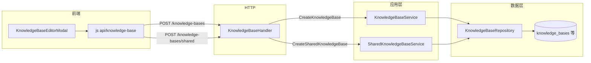

# 创建知识库模块详细设计

**文档版本**：2026-04-08  
**适用范围**：WeKnora 知识库「新建」能力（个人/共享标记、文档库与 FAQ 库、配置落库），不含文档上传与解析流水线细节（参见 `docs/2026-04-08-文档上传与解析流程说明.md`）。

---

## 1. 目标与范围

### 1.1 目标

- 用户在本租户下创建知识库实体，并一次性写入分块、模型、存储、解析、FAQ 等与检索相关的配置。
- 支持 **文档型（document）** 与 **FAQ 型（faq）** 两类知识库。
- 支持 **可见性**：`private`（个人）与 `shared`（可被广场/成员体系使用的共享库标记）；与「组织内共享」「成员加入」属于不同维度，见下文概念区分。

### 1.2 不在本文展开

- 知识库复制、删除异步清理、混合检索管道、组织侧 `kb_share` 配置界面。

---

## 2. 业务概念

| 概念 | 说明 |
|------|------|
| **类型 `type`** | `document`：文件/网页等知识条目 + 分块向量；`faq`：问答条目 + 独立索引策略。 |
| **可见性 `visibility`** | `private`：默认个人库；`shared`：标记为共享库（可出现在广场列表等逻辑中）。数据库字段见 `knowledge_bases.visibility`。 |
| **创建方式 A：`POST /knowledge-bases`** | `KnowledgeBaseService.CreateKnowledgeBase`：写 `knowledge_bases` 行，设置 `tenant_id`、`owner_id`（来自上下文用户），不经过 `SharedKnowledgeBaseService`。 |
| **创建方式 B：`POST /knowledge-bases/shared`** | `SharedKnowledgeBaseService.CreateSharedKnowledgeBase`：强制 `visibility=shared`，写库并 **创建 owner 成员记录**（`knowledge_base_members`），`member_count` 等字段与共享广场链路一致。 |
| **组织共享** | 将已有知识库共享到组织（`kb_share`），与「创建」正交；创建完成后在设置页配置。 |

**实现注意**：前端创建向导当前统一调用 `POST /knowledge-bases` 并可在表单中选择 `visibility=shared`。该路径 **不会** 自动写入 `knowledge_base_members`。若产品要求「创建即具备广场成员语义」，应优先调用 **`POST /knowledge-bases/shared`**，或在后端对 `visibility=shared` 的创建路径统一收口到共享服务（属后续改造项）。

---

## 3. 总体架构

- **鉴权**：路由位于需登录的 API 组；上下文注入 `TenantID`、`UserID`（Bearer 或 X-API-Key 路径下的合成用户，见 `internal/middleware/auth.go`）。
- **多租户**：创建时 `tenant_id` 一律取 `types.MustTenantIDFromContext(ctx)`，与请求头/切换租户一致。

---

## 4. 接口设计

### 4.1 创建普通知识库

| 项 | 内容 |
|----|------|
| **Method / Path** | `POST /api/v1/knowledge-bases` |
| **Handler** | `KnowledgeBaseHandler.CreateKnowledgeBase`（`internal/handler/knowledgebase.go`） |
| **请求体** | `types.KnowledgeBase` JSON 子集（Gin `ShouldBindJSON`） |
| **成功响应** | HTTP `201`，`{ "success": true, "data": <KnowledgeBase> }` |

**Handler 侧校验**：

- `validateExtractConfig(req.ExtractConfig)`：解析/图谱相关 extract 配置合法性（与创建同时提交时生效）。

**服务端写入逻辑**（`KnowledgeBaseService.CreateKnowledgeBase`）：

1. 若 `id` 为空则生成 UUID。
2. `created_at` / `updated_at` 设为当前时间。
3. `tenant_id` ← 上下文租户。
4. `owner_id` ← 上下文 `UserID`（存在且非空时）。
5. `EnsureDefaults()`：补全 `type` 默认 `document`；FAQ 类型时补全 `faq_config` 默认值（`internal/types/knowledgebase.go`）。
6. `repo.CreateKnowledgeBase` 持久化。

### 4.2 创建共享知识库（广场/成员体系）

| 项 | 内容 |
|----|------|
| **Method / Path** | `POST /api/v1/knowledge-bases/shared` |
| **Handler** | `KnowledgeBaseHandler.CreateSharedKnowledgeBase` |
| **行为** | 将请求体绑定为 `KnowledgeBase` 后 **强制** `req.Visibility = shared`，调用 `SharedKnowledgeBaseService.CreateSharedKnowledgeBase`。 |
| **成功响应** | HTTP `201`，结构同上。 |

**共享服务要点**（`internal/application/service/shared_kb.go`）：

- 设置 `visibility=shared`、`owner_id`、`shared_at`、`member_count` 等。
- 创建 `knowledge_bases` 记录后，插入 **owner** 角色的 `knowledge_base_members` 行（创建者租户 `tenant_id` 来自上下文）。

### 4.3 路由注册

见 `internal/router/router.go` → `RegisterKnowledgeBaseRoutes`：`POST ""` 与 `POST "/shared"`。

---

## 5. 领域模型与主要字段

核心结构：`internal/types/knowledgebase.go` → `KnowledgeBase`。

| 分组 | 字段（创建时常用） | 说明 |
|------|-------------------|------|
| 标识与描述 | `id`, `name`, `description`, `type` | `type` 默认 `document`。 |
| 租户与归属 | `tenant_id`（服务端覆盖）, `owner_id`（服务端填充） | |
| 可见性 | `visibility` | `private` / `shared`。 |
| 分块 | `chunking_config` | 大小、重叠、分隔符、父子分块、解析引擎规则等。 |
| 模型 | `embedding_model_id`, `summary_model_id` | 检索与摘要依赖；前端校验必填。 |
| 多模态 | `vlm_config` | 启用与 VLM `model_id`。 |
| 存储 | `storage_provider_config`（JSONB）与 legacy `cos_config` | 新建多使用 `storage_config`（前端）映射到存储提供者选择；凭证在租户级配置。 |
| 图谱 | `extract_config` | 结构化抽取开关与规则。 |
| FAQ | `faq_config` | `index_mode`, `question_index_mode`；仅 FAQ 类型需要。 |
| 问题生成 | `question_generation_config` | 文档库可选。 |

**只读/派生字段**（`gorm:"-"`）：如 `knowledge_count`、`chunk_count`、`share_count`，创建响应中可能为 0 或未计算。

---

## 6. 前端模块设计

### 6.1 API 封装

- 文件：`frontend/src/api/knowledge-base/index.ts`
- `createKnowledgeBase(data)` → `POST /api/v1/knowledge-bases`
- `createSharedKnowledgeBase(data)` → `POST /api/v1/knowledge-bases/shared`（当前在编辑器中已 import，**创建主流程以 `createKnowledgeBase` 为主**）

### 6.2 创建/编辑向导

- 组件：`frontend/src/views/knowledge/KnowledgeBaseEditorModal.vue`
- **模式** `mode === 'create'`：`buildSubmitData()` 组装与后端一致的 JSON（含 `visibility`、`chunking_config`、`embedding_model_id`、`summary_model_id`、`vlm_config`、`storage_config.provider`、`extract_config`、`faq_config`、`question_generation_config` 等），调用 `createKnowledgeBase`。
- **校验**：名称、Embedding 模型、摘要模型必填；FAQ 需索引模式；多模态开启时需 VLM 模型。
- **入口**：知识库列表等页面打开 Modal（具体路由见 `KnowledgeBaseList.vue` 等）。

### 6.3 与列表、广场的关系

- 列表：`KnowledgeBaseList.vue` 展示 `visibility`、置顶（共享库不允许置顶，后端 `ErrSharedKnowledgeBasePinNotAllowed`）。
- 广场：`SharedKnowledgeBaseSquare.vue` 拉取 `GET /knowledge-bases/shared`，用户 **加入** 走 `POST /:id/join`，与「创建」分离。

---

## 7. 数据持久化

- **表**：`knowledge_bases`（主键 `id`，含 `tenant_id`、`owner_id`、`visibility`、`chunking_config` JSON、`embedding_model_id`、`summary_model_id`、`vlm_config`、`extract_config`、`faq_config`、`storage_provider_config` 等）。
- **共享成员表**：仅 `CreateSharedKnowledgeBase` 路径保证创建时写入 `knowledge_base_members`（owner）。

具体 DDL 以 `migrations/` 下当前版本为准。

---

## 8. 错误处理与日志

- 参数绑定失败 → `400` + `AppError` 详情。
- `validateExtractConfig` 失败 → `400`。
- 创建过程数据库错误 → `500` + 日志 `ErrorWithFields`（含 `knowledge_base_id` / `tenant_id` 等字段）。

---

## 9. 安全与权限

- 创建仅允许已认证上下文；租户隔离由 `tenant_id` 写入保证。
- 普通 `POST /knowledge-bases` 不校验「是否允许创建 shared」的业务规则（若需限制，应在 Handler 或 Service 增加策略）。
- `POST /shared` 与普创建共用同一认证体系，差异在业务服务层。

---

## 10. 测试建议

- 接口：`POST /knowledge-bases` 最小合法 body（document + 双模型）；FAQ 类型 + `faq_config`。
- `POST /knowledge-bases/shared`：断言返回 `visibility=shared` 且成员表存在 owner。
- 租户：切换 `X-Tenant-ID`（若启用）后创建归属目标租户。

---

## 11. 参考源码索引

| 模块 | 路径 |
|------|------|
| 领域模型 | `internal/types/knowledgebase.go` |
| 创建（普通） | `internal/application/service/knowledgebase.go` → `CreateKnowledgeBase` |
| 创建（共享） | `internal/application/service/shared_kb.go` → `CreateSharedKnowledgeBase` |
| HTTP | `internal/handler/knowledgebase.go` → `CreateKnowledgeBase`, `CreateSharedKnowledgeBase` |
| 路由 | `internal/router/router.go` → `RegisterKnowledgeBaseRoutes` |
| 仓储 | `internal/application/repository/knowledgebase.go` → `CreateKnowledgeBase` |
| 前端 API | `frontend/src/api/knowledge-base/index.ts` |
| 前端向导 | `frontend/src/views/knowledge/KnowledgeBaseEditorModal.vue` |

---

## 12. 修订记录

| 日期 | 说明 |
|------|------|
| 2026-04-08 | 初稿：对齐当前仓库创建双路径、模型字段与前端向导行为；注明 shared 创建与成员表一致性注意点。 |
