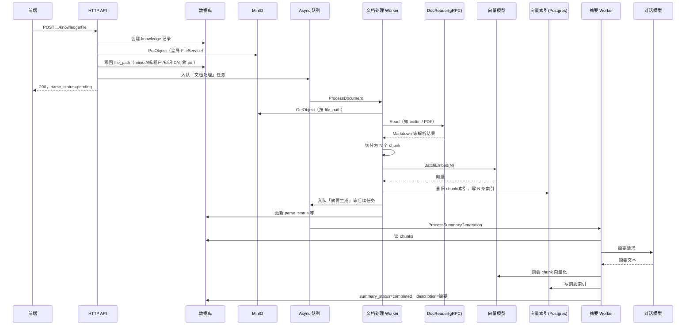

# 文档上传与解析流程说明

本文说明 WeKnora 知识库「文件上传 → 异步解析 → 分块向量化 → 摘要」的全链路：前半部分偏**运行现象与排障**，**第 8 节起为基于源码的机制说明**（解析引擎选择、分段策略、向量写入与摘要策略等）。

---

## 1. 流程总览

---

## 2. 阶段一：上传与创建知识（同步 HTTP）

| 步骤 | 说明 |
|------|------|
| 创建记录 | `CreateKnowledgeFromFile` 在数据库中插入一条 `knowledge`，此时解析尚未开始。 |
| 存储解析 | `[storage] resolveFileService fallback default` 表示知识库/租户**未**配置独立存储引擎，使用进程内**默认** `FileService`（常见为 MinIO）。 |
| 保存文件 | 调用 `PutObject`，成功后生成 `file_path`，格式为 `minio://{bucket}/{tenant_id}/{knowledge_id}/{uuid}.{ext}`。`bucket` 须与 `MINIO_BUCKET_NAME` 一致。 |
| 异步入队 | `Enqueuing document processing task to Asynq`：解析在 **Worker** 中执行，不在本次 HTTP 请求内完成。 |
| 接口返回 | 通常 `parse_status=pending`，`error_message` 为空。 |

---

## 3. 阶段二：文档处理任务 `ProcessDocument`（Asynq，带重试）

| 步骤 | 说明 |
|------|------|
| 任务入口 | 日志形如 `Processing document task: knowledge_id=..., retry=i/3`。 |
| 引擎选择 | `[convert]` 中 `engine=builtin` 且 PDF 等类型时，走 **DocReader gRPC**（`Read`）；`simple` 等可走 Go 内置简单解析。 |
| 读文件 | 再次出现 `resolveFileService fallback default` 时，仍表示使用默认 MinIO 客户端从 `file_path` 拉取对象。 |
| 图片 | `Resolved N images`：解析结果中的图片引用数量；为 0 表示本文件无图或引擎未产出图。 |
| 分块 | `Split document into K chunks`：按产品策略将正文切成 K 段。 |
| 向量模型 | `GetEmbeddingModel`：使用知识库/租户配置的嵌入模型（如 remote OpenAI 兼容接口）。 |
| `processChunks` | 先清理该知识下旧 chunk 与向量索引，再写入新 chunk 与索引；若启用图检索且驱动不支持，可能出现 `NOT SUPPORT RETRIEVE GRAPH` 警告，**一般不影响**主流程。 |
| DocReader 概览日志 | `[DocReader] ========== 解析结果概览 ==========`：输出各 chunk 长度与内容预览，便于排查截断、乱码。 |
| 写入索引 | `[Postgres] Batch saving N indices`（或当前部署使用的检索驱动等价日志）：向量持久化。 |
| 后续任务 | 如 `enqueueSummaryGenerationTask`：解析成功后**再入队**摘要任务。 |

解析成功后，知识状态会变为 `parse_status=completed`；摘要未完成时 `summary_status` 可能为 `processing`。

---

## 4. 阶段三：摘要任务 `ProcessSummaryGeneration`（独立异步任务）

| 步骤 | 说明 |
|------|------|
| 读块 | `ListChunksByKnowledgeID` 拉取已落库的 chunk，拼成摘要上下文。 |
| 对话模型 | `GetChatModel` + `chatWithRawHTTP`（或等价路径）：按配置的 Chat 模型生成摘要。 |
| 写回 | 摘要写入 `description` 等字段；并可为摘要单独创建 chunk、再次 embedding、写入索引，便于检索。 |
| 结束 | `summary_status=completed`。 |

前端常通过 `GET /api/v1/knowledge/batch?ids=...` 轮询观察 `parse_status` / `summary_status` 变化。

---

## 5. 日志与现象说明

### 5.1 `resolveFileService fallback default`

**不是错误**。含义：未命中租户级 `StorageEngineConfig` 的专用解析路径，使用全局默认存储服务（与 `STORAGE_TYPE=minio` 等环境变量一致）。

### 5.2 解析预览中的乱码字符（如 ``）

多见于 **日志管道或终端编码**（UTF-8 被误解释）；若仅出现在 DEBUG 预览而数据库/API 返回正文正常，可优先检查日志输出编码。若入库内容同样损坏，再查 PDF 源文件与 DocReader 输出编码。

### 5.3 OpenTelemetry / `4317` 连接失败

例如：`traces export ... dial tcp 127.0.0.1:4317 ... refused`。

与**文档解析业务无关**，是向 **Jaeger OTLP** 导出链路追踪失败（本机未启动 Jaeger 或 `OTEL_EXPORTER_OTLP_ENDPOINT` 指向错误）。可减少日志噪音：关闭 OTLP 导出或指向可用的 Collector/Jaeger。

---

## 6. 常见问题与日志对照

| 现象 | 可能原因 | 处理方向 |
|------|----------|----------|
| `gRPC Read failed: ... Unimplemented ... Method not found` | App 连接的并非 WeKnora DocReader，或 **App 与 DocReader 镜像版本不一致**（proto/服务不一致）。 | 核对 `DOCREADER_ADDR`；`weknora-app` 与 `weknora-docreader` 使用同一 `WEKNORA_VERSION`（或同一 tag）；升级 docreader 时避免 compose `build` 覆盖预期镜像。 |
| `The specified bucket does not exist` | MinIO 上不存在 `file_path` 中的桶名，或 App 连到了**空实例/错误 endpoint**。 | 在**当前** `MINIO_ENDPOINT` 与凭证下创建对应桶；历史数据若对象已丢需重新上传或恢复 MinIO 数据。 |
| `bucket mismatch in path` | `minio://` 路径中的桶名与 `MINIO_BUCKET_NAME` 不一致。 | 统一环境变量与历史 `file_path`，或修正迁移数据。 |

---

## 7. 相关代码位置（便于二次阅读）

| 能力 | 路径 |
|------|------|
| gRPC DocReader 客户端 | `internal/infrastructure/docparser/grpc_parser.go` |
| MinIO 路径解析与读写 | `internal/application/service/file/minio.go` |
| 存储选择 / `filePath` 与配置不一致时的回退 | `internal/application/service/knowledge.go`（`resolveFileService`、`resolveFileServiceForPath`） |
| 文档处理与分块摘要 | `internal/application/service/knowledge.go`（`ProcessDocument`、`processChunks`、`ProcessSummaryGeneration` 等） |
| DocReader gRPC 定义 | `docreader/proto/docreader.proto` |
| 文本分段（递归分隔 + 保护区间） | `internal/infrastructure/chunker/splitter.go` |
| 混合检索引擎批量索引 | `internal/application/service/retriever/keywords_vector_hybrid_indexer.go` |
| 多引擎并发写入 | `internal/application/service/retriever/composite.go` |
| 嵌入批处理与协程池 | `internal/models/embedding/batch.go` |
| 知识库分段/解析规则配置结构 | `internal/types/knowledgebase.go`（`ChunkingConfig`） |

---

## 8. 基于源码：解析引擎、分段与向量策略

以下按**调用顺序**说明 `ProcessDocument` → `convert` → 分段 → `processChunks` → `BatchIndex` → 摘要任务，便于对照代码阅读。

### 8.1 异步入口与幂等

- **入口**：`knowledgeService.ProcessDocument`（`internal/application/service/knowledge.go`），消费 Asynq 任务 `DocumentProcessPayload`。
- **重试**：通过 `asynq.GetRetryCount` / `GetMaxRetry` 判断是否在最后一次重试；失败写库仅在末次重试时由 `failKnowledge` 等路径落 `parse_status=failed`。
- **幂等**：若 `parse_status` 已为 `completed` 则直接跳过；处理前若知识处于 `deleting` 则中止。
- **流水线注释**（源码）：`convert -> store images -> chunk -> vectorize -> multimodal tasks`。

### 8.2 解析引擎选择（`convert` + `resolveDocReader`）

1. **规则来源**：知识库 `ChunkingConfig.ParserEngineRules`（`internal/types/knowledgebase.go`），每项包含 `FileTypes` 与 `Engine`。
2. **解析**：`ChunkingConfig.ResolveParserEngine(fileType)` 按扩展名匹配第一条规则；**未匹配时返回空字符串**。
3. **URL 导入**：若 `payload.URL` 非空，引擎改为 `ResolveParserEngine("url")`（即按字面类型 `url` 匹配规则）。
4. **读实现**（`resolveDocReader`）：
   - `simple` → `SimpleFormatReader`（Go 内建简单格式）。
   - `mineru` / `mineru_cloud` → 对应 HTTP 类 Reader。
   - `builtin` → 注入的 `s.documentReader`（通常为 **DocReader gRPC**）。
   - **默认**（引擎为空或未命中 switch）：非 URL 且 `IsSimpleFormat(fileType)` 时用 `SimpleFormatReader`，否则 **回退 DocReader**。

5. **读文件**：非 URL 时通过 `resolveFileServiceForPath` + `GetFile` 拉取二进制，再构造 `ReadRequest`（含 `ParserEngine`、`ParserEngineOverrides`）调用 `reader.Read`。

### 8.3 DocReader 输出后的预处理

- **图片**：若配置了 `imageResolver`，对 `ReadResult` 做 `ResolveAndStore`，可能改写 `MarkdownContent` 并得到 `StoredImages`；供后续多模态任务使用。
- **正文**：以 **Markdown 字符串** 作为分段输入（`convertResult.MarkdownContent`）。

### 8.4 分段策略（`internal/infrastructure/chunker`）

分段配置来自 **`KnowledgeBase.ChunkingConfig`**，在 `ProcessDocument` 末尾组装为 `chunker.SplitterConfig`：

| 字段 | 源码默认值（当配置 ≤0 或分隔符为空时） |
|------|----------------------------------------|
| `ChunkSize` | 512（rune 粒度） |
| `ChunkOverlap` | 50 |
| `Separators` | `["\n\n", "\n", "。"]` |

**核心算法 `SplitText`**（`splitter.go`）：

1. **保护区间（protected spans）**：对下列模式整段视为原子单元，**优先不被切开**：LaTeX `$$...$$`、Markdown 图片/链接、表格行、 fenced code block 等（正则见 `protectedPatterns`）。
2. **超大保护块**：若单段保护内容超过 **7500 runes**，在保护区内再按换行/空格强制折断，避免下游（如 Embedding API）超长。
3. **非保护区**：按 `Separators` 顺序拆成 `splitUnit`，保留分隔符片段。
4. **合并为 chunk**：`mergeUnits` 将 unit 拼入当前 chunk；超过 `ChunkSize` 则落盘当前 chunk，并按 `ChunkOverlap` 从尾部 unit **回溯**保留重叠（`computeOverlap`），且跳过仅含空白/分隔符的 overlap 头。
5. **绝对上限**：任意 chunk 合并后仍受 **7500 runes** 硬顶，必要时在 unit 内再拆。

**包内另有** `DefaultConfig()`：`ChunkOverlap` 默认为 128，与知识库未配置时 **服务内联的 50** 不一致——实际以 `knowledge.go` 中写死的兜底为准。

### 8.5 父子分段（Parent–Child）

当 `ChunkingConfig.EnableParentChild == true`（`internal/types/knowledgebase.go`）：

- **`buildParentChildConfigs`**（`knowledge.go`）：
  - 父块：`ParentChunkSize`，默认 **4096**；`ChunkOverlap` 与基础配置相同。
  - 子块：`ChildChunkSize`，默认 **384**；子块 overlap 固定为 **`childSize/5`（约 20%）**。
- **`SplitTextParentChild`**：先对全文 `SplitText` 得父块，再对每个父块内容 `SplitText` 得子块；子块 `Start/End` 会换算为**全文 rune 偏移**；`ParentIndex` 指向父块序号。

**入库与索引**（`processChunks`）：

- 父块：`ChunkTypeParentText`，**只入库**，通过 `PreChunkID`/`NextChunkID` 链成序；**不参与** `indexInfoList`，**不向量化**。
- 子块：`ChunkTypeText`，挂 `ParentChunkID`；**不向普通模式那样设置子块间 Pre/Next**（父子模式下跳过子块链表）。
- **检索语义**：设计意图为「匹配在子块、上下文可回到父块」（具体检索侧是否展开父块由检索实现决定，此处仅描述写入策略）。

### 8.6 `processChunks`：入库、索引内容、配额与后续任务

1. **嵌入模型**：`modelService.GetEmbeddingModel(ctx, kb.EmbeddingModelID)`，失败则整段返回。
2. **幂等清理**：删除该 knowledge 下旧 chunks；`CompositeRetrieveEngine.DeleteByKnowledgeIDList` 删向量索引；`graphEngine.DelGraph` 尝试删图（部分驱动不支持时仅 warn）。
3. **构建 DB Chunk**：跳过空白 `ParsedChunk`；若有图片元数据，源码中为 OCR/Caption **预留了 slice 容量**（`imageChunkCount`），**主循环当前只插入文本块**；图片 OCR/Caption 子块主要由 **多模态异步任务**等路径维护（见 `image_multimodal` 相关逻辑）。
4. **向量化文本构造**：对每个参与检索的文本块，`IndexInfo.Content = titlePrefix + chunk.Content`，其中 `titlePrefix = knowledge.Title + "\n"`（有标题时）。用于拉近「问句型查询」与「陈述型正文」的语义距离。
5. **存储配额**：`EstimateStorageSize` 后若 `tenant.StorageQuota` 有值且超出，则失败并提示「存储空间不足」。
6. **持久化顺序**：`CreateChunks` → `retrieveEngine.BatchIndex`；索引失败会回滚删除 chunks 与索引。
7. **状态**：
   - 普通文件：解析完成后 `parse_status=completed`、`enable_status=enabled`，`summary_status` 置为 **pending** 并 **入队摘要**。
   - **图片知识**且待多模态：`parse_status` 维持 **processing**，直到多模态完成再视为完成（避免前端过早展示无描述图片）。
8. **可选异步任务**：
   - `QuestionGenerationConfig.Enabled` → `enqueueQuestionGenerationTask`（`low` 队列，`QuestionCount` 默认 3、上限 10）。
   - `ExtractConfig.Enabled` → 每文本块一个 chunk extract 任务（关系 RAG 等）。
   - 多模态：`enqueueImageMultimodalTasks`。

### 8.7 向量写入策略（`BatchIndex`）

- **组合引擎**：`CompositeRetrieveEngine.BatchIndex`（`composite.go`）对租户启用的**每个**检索后端**并发**执行 `BatchIndex`，**任一失败则整体失败**；入参按 `SourceID` 去重。
- **关键词+向量混合实现**：`KeywordsVectorHybridRetrieveEngineService.BatchIndex`（`keywords_vector_hybrid_indexer.go`）：
  - 若包含 `VectorRetrieverType`：收集所有 `IndexInfo.Content`，调用 **`embedder.BatchEmbedWithPool`**；失败时 **最多重试 5 次**，间隔 100ms。
  - 向量结果写入：按 **batchSize=40** 切块，使用 errgroup **并发** `BatchSave`（小批量时全并发，大批量时限流 `maxConcurrency=5`）。
- **协程池批嵌入**：`internal/models/embedding/batch.go` 中 `BatchEmbedWithPool` 将文本再按 **`BATCH_EMBED_SIZE` 环境变量（默认 5）** 分组，每组调用底层 `Embedder.BatchEmbed`；各厂商 `BatchEmbed` 另有自身限制（例如 OpenAI 兼容实现会校验单条长度并在日志中提示）。

### 8.8 摘要策略（`ProcessSummaryGeneration` + `getSummary`）

1. **触发**：`processChunks` 末尾 `enqueueSummaryGenerationTask`；任务类型 `TypeSummaryGeneration`，`low` 队列。
2. **前置条件**：`kb.SummaryModelID` 非空；否则跳过。
3. **选用块**：仅 `ChunkTypeText`，按 `ChunkIndex` 排序。
4. **`getSummary` 拼文规则**：
   - 按 `StartAt` 排序后拼接；当 **`chunk.EndAt > 4096`（rune 意义下与源码一致）时停止追加**，即摘要输入主要来自**文档前部约 4096 单位范围内的块**（实现上混合了 `StartAt` 与拼接逻辑，超长时可能以 append 方式继续，以代码为准）。
   - 去掉 Markdown 图片语法；若有 `ImageInfo` JSON，附加 Caption/OCR 文本片段。
   - 若拼接后总长**不足 300 字符**，**不再调用 LLM**，直接返回该短文。
   - 否则在内容前附加 `Document Type` / `File Name` / `Knowledge Type`，使用配置模板 `GenerateSummaryPrompt` 调用 Chat：`Temperature=0.3`，`MaxTokens=1024`，`Thinking=false`。
5. **失败兜底**：摘要生成失败时，用**第一个文本块前 500 字符**写入 `description`（源码路径仍标记 `summary_status=completed`）。
6. **摘要块与二次索引**：成功时额外创建 `ChunkTypeSummary`，内容为 `# Document\n{fileName}\n\n# Summary\n{summary}`，`ParentChunkID` 指向第一个文本块；使用**同一** `kb.EmbeddingModelID` 再 `BatchIndex` **一条**索引，便于检索命中摘要。

---

## 9. 修订记录

| 日期 | 说明 |
|------|------|
| 2026-04-08 | 初版：根据实际上传解析成功样例日志整理流程与排障对照。 |
| 2026-04-08 | 增补第 8 节：基于源码的解析引擎、分段、向量批量写入与摘要策略说明；扩展第 7 节代码索引。 |
