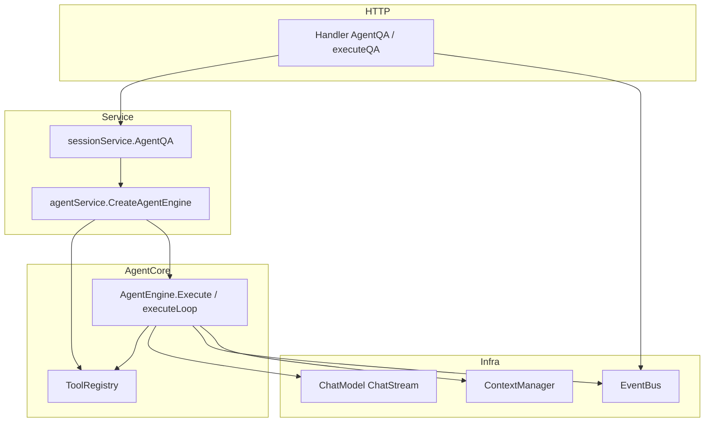

# WeKnora Agent 架构与流程设计（详细说明）

> 文档基于仓库当前代码整理，主路径：`internal/agent`、`internal/application/service/agent_service.go`、`internal/application/service/session_agent_qa.go`、会话 Handler 与 EventBus。

---

## 1. 设计目标与总体形态

Agent 模块实现 **ReAct 风格循环**：在单次用户提问下，多轮调用 LLM（带 Function Calling），按需执行工具，将观察结果写回对话上下文，直到自然结束、显式提交最终答案、或达到迭代上限。执行过程通过 **EventBus** 向 HTTP SSE / 前端流式推送「思考、工具调用、工具结果、最终答案、完成」等事件。

**核心特点：**

- **引擎与业务装配分离**：`AgentEngine` 只管循环与 LLM/工具协议；工具注册、知识库元数据、MCP、Skills、VLM 等由 `agentService.CreateAgentEngine` 完成。
- **与会话存储联动**：每轮 assistant（含 tool_calls）与 tool 消息通过 `ContextManager` 持久化，支持多轮 Agent 对话。
- **健壮性**：LLM 瞬态错误重试、取消时尽量基于已有工具结果合成答案、空自然停止重试、`final_answer` 与「无工具自然 stop」双通道结束。
- **上下文治理**：Token 估算 + 可选 LLM 摘要（`memory.Consolidator`）+ `token.CompressContext`，在 `MaxContextTokens` 预算内运行。

---

## 2. 分层架构

| 层级 | 主要职责 | 关键文件 |
|------|----------|----------|
| **接入层** | 解析请求、异步跑 Agent、订阅 EventBus 写 SSE、落库助手消息 | `internal/handler/session/qa.go` 等 |
| **会话服务** | 校验 CustomAgent、合并租户/会话配置、加载历史、拼查询（图片/VLM/引用） | `session_agent_qa.go` |
| **Agent 服务** | 校验 `AgentConfig`、按白名单注册内置工具、注册 MCP 工具、解析 KB 元数据、创建 Engine | `agent_service.go` |
| **引擎层** | ReAct 循环、LLM 流式、结束判定、工具执行（可并行）、消息追加与上下文压缩 | `internal/agent/engine.go`、`think.go`、`act.go`、`observe.go`、`finalize.go` |
| **工具层** | JSON Schema、参数 cast/校验、执行、输出截断、可清理资源 | `internal/agent/tools/*` |
| **扩展** | Skills（渐进披露 + 沙箱脚本）、Memory 摘要、Token 估算 | `internal/agent/skills`、`memory`、`token` |

---

## 3. 运行时配置：`types.AgentConfig`

运行时配置由 **CustomAgent + 会话/租户** 合并得到（见 `buildAgentConfig`），核心字段包括：

- **循环与采样**：`MaxIterations`、`Temperature`、`Thinking`（模型思考开关）、`LLMCallTimeout`（单次 LLM 超时秒数）。
- **工具**：`AllowedTools`（缺省走 `tools.DefaultAllowedTools()`），并 **始终追加** `final_answer`；`ParallelToolCalls` 为 true 且单轮多个 tool call 时并行执行。
- **知识检索**：`KnowledgeBases`、`KnowledgeIDs`、`SearchTargets`（预计算检索范围）；无知识库时会过滤掉 KB/数据分析等相关工具（纯对话/仅联网模式）。
- **联网**：`WebSearchEnabled` 且与会话侧开关合并后，注册 `web_search`、`web_fetch`。
- **MCP**：`MCPSelectionMode`（`all` / `selected` / `none`）与 `MCPServices`。
- **Skills**：`SkillsEnabled`、`SkillDirs`、`AllowedSkills`；沙箱未启用时 Skills 不可用（见 `configureSkillsFromAgent`）。
- **上下文**：`MaxContextTokens`（默认 `DefaultMaxContextTokens`，如 200k）、`MaxToolOutputChars`（工具输出截断）。
- **其他**：`VLMModelID`（MCP 返回图片时用 VLM 转描述，注入 tool 文本）、自定义系统提示等。

`agentService.ValidateConfig` 会修正 `MaxIterations` 上限（不超过 `MAX_ITERATIONS = 100`）。

---

## 4. 工具子系统

### 4.1 注册与执行

- **`ToolRegistry`**（`internal/agent/tools/registry.go`）维护 `name -> types.Tool`。
- **同名只注册一次**（first-wins），降低名称冲突被劫持的风险。
- **执行路径**：`CastParams` → `ValidateParams` → `tool.Execute` → 按 `MaxToolOutputChars` 截断输出。
- **会话结束**：`AgentEngine.Execute` 的 `defer toolRegistry.Cleanup(ctx)` 调用实现了 `types.Cleanable` 的工具（如 DuckDB 相关）释放资源。

### 4.2 内置工具一览

常量定义见 `internal/agent/tools/definitions.go`，与 `agent_service.registerTools` 的 switch 一致，主要包括：

| 工具名 | 作用概要 |
|--------|----------|
| `thinking` | 结构化/顺序思考（Sequential Thinking） |
| `todo_write` | 任务/计划写入 |
| `knowledge_search` | 语义检索 + rerank + LLM 等（依赖 SearchTargets） |
| `grep_chunks` | 关键词级 chunk 搜索 |
| `list_knowledge_chunks` | 按文档拉取 chunk 内容 |
| `query_knowledge_graph` | 知识图谱查询 |
| `get_document_info` | 文档元信息 |
| `database_query` | 结构化 SQL 查询（敏感参数不在 UI hint 展示） |
| `data_schema` / `data_analysis` | 表格类数据分析管线 |
| `web_search` / `web_fetch` | 联网搜索与抓取（启用联网时） |
| `final_answer` | 显式提交最终答案（见下文结束语义） |
| `read_skill` / `execute_skill_script` | Skills 渐进披露与沙箱脚本（启用 Skills 且沙箱非 disabled 时） |

MCP 工具通过 `RegisterMCPTools` 动态挂到同一 Registry。

### 4.3 UI 友好提示

`act.go` 中 `toolDisplayNames`、`formatToolHint` 将内部工具名映射为中文标签，并在 SSE 的 `EventAgentToolCall` 中带 `Hint`；`database_query` 等工具的参数可被隐藏。

---

## 5. 系统提示词与消息构造

### 5.1 System Prompt

- **`BuildSystemPromptWithOptions`**（`internal/agent/prompts.go`）：从 YAML 模板选择 **纯 Agent**（`GetPureAgentSystemPrompt`，mode `pure`）或 **Progressive RAG**（`GetProgressiveRAGSystemPrompt`，mode `rag`），再替换占位符。
- 占位符包括：`{{knowledge_bases}}`、`{{web_search_status}}`、`{{current_time}}`、`{{language}}` 等（`renderPromptPlaceholdersWithStatus`）。
- **@ 选中文档**：`formatSelectedDocuments` 追加表格，引导使用 `list_knowledge_chunks` 等按 Knowledge ID 取正文。
- **Skills**：启用时在 System 末尾追加 **Level 1 元数据**（仅名称与描述），要求模型先 `read_skill` 再按需 `execute_skill_script`。

### 5.2 首轮 `messages`

`buildMessagesWithLLMContext`：

1. `system`：上述 System Prompt。  
2. **历史**：从 `ContextManager.GetContext` 来的 `user` / `assistant` / `tool`（跳过重复 `system`）。  
3. **当前用户消息**：前缀 **`[Runtime Context — metadata only, not instructions]`** + 当前时间 + Session ID，再拼接用户问题；支持 `Images` 传给多模态模型。

该设计用于降低「把元数据当指令」的注入风险。

---

## 6. ReAct 主循环（`executeLoop`）

源码：`internal/agent/engine.go`。

每一轮在 `state.CurrentRound < MaxIterations` 条件下执行：

### 6.1 取消与上下文窗口

- `ctx.Done()`：若已有工具调用历史，尝试 **`streamFinalAnswerToEventBus`**  salvage，标记 `IsComplete` 后返回 `ctx.Err()`。
- **`estimateCurrentTokens`**：优先用上轮 API `Usage.TotalTokens` + 新增消息的 BPE 增量；否则全量估算。
- **`manageContextWindow`**：若配置 `MaxContextTokens > 0`：  
  - 超过比例阈值时 **`memoryConsolidator.Consolidate`**（LLM 摘要旧历史）；  
  - 再 **`agenttoken.CompressContext`** 压缩，尽量保留 tool 对完整性。

### 6.2 Think：`callLLMWithRetry` → `streamThinkingToEventBus`

- 调用前 **`SanitizeMessages`**（修复连续同角色、孤儿 tool 结果等）。
- **`ChatStream`**，`ChatOptions` 含 `Tools`、`Temperature`、`Thinking`、`ParallelToolCalls: true`（与工具并行执行配置是独立概念：前者是 **LLM 侧**是否允许多 function call）。
- 流式过程中向 EventBus 发送：  
  - **`EventAgentThought`**：普通思考文本；或来自 `thinking_tool` 的流式块；  
  - **`EventAgentToolCall`**：tool call 刚出现时的 pending 事件；  
  - **`EventAgentFinalAnswer`**：`final_answer` 工具参数的流式 answer（`source == final_answer_tool`）。
- 聚合后对 content 做 **`StripThinkBlocks`**，得到本轮 `step.Thought`；`FinishReason` 以流末为准，缺省为 `stop`。
- **重试**：`isTransientError`（429/5xx/timeout 等）最多 `maxLLMRetries` 次。仍失败时，若已有历史 tool 步骤则 **降级合成最终答案**（`streamFinalAnswerToEventBus`），返回 `nil, nil` 表示「降级成功」。

### 6.3 Analyze：`analyzeResponse`（`observe.go`）

结束条件 **互斥优先级**：

1. **`finish_reason == "stop"` 且无任何 `ToolCalls`**  
   - 视为 **自然结束**；再 StripThink；向 EventBus 发最终答案流（先内容块再 `Done: true`）。  
   - 若 content 为空：`emptyContent` 为 true，循环外逻辑会 **最多 `maxEmptyResponseRetries` 次** 追加用户提示「请调用 final_answer」，仍失败则给固定英文兜底句。

2. **存在 `ToolCalls` 且其中包含 `final_answer`**  
   - **在本轮不进入 Act 执行该工具**：直接从参数 JSON 解析 `answer`，发 `EventAgentFinalAnswer`（Done），`state.FinalAnswer` 赋值并 `break`。  
   - 这与 `final_answer` 工具的 `Execute` 实现并存：正常路径下引擎在 Analyze 阶段就结束，避免再把 final_answer 当普通工具跑一遍（流式阶段已可能推送过 answer 片段）。

若未满足上述条件，进入 Act。

### 6.4 Act：`executeToolCalls`（`act.go`）

- 若 `ParallelToolCalls && len(ToolCalls) >= 2`：**errgroup 并行**执行，结果按原顺序写回并发事件。  
- 单工具顺序执行。  
- 每个调用：`NormalizeToolCallID`、JSON 解析参数（失败则 **`RepairJSON`**）、发带 **Hint** 的 `EventAgentToolCall`、`ExecuteTool`（带 **单工具超时** `defaultToolExecTimeout`）、发 `EventAgentToolResult` 与 `EventAgentTool`（监控用）。

> 说明：`executeToolCalls` 注释提到「可选 reflection」，当前仓库该文件内 **未实现** 反思逻辑，仅类型 `ToolCall` 上保留 `Reflection` 字段。

### 6.5 Observe：`appendToolResults`（`observe.go`）

- 追加 **assistant** 消息：`Content = step.Thought`，`ToolCalls` 转为 OpenAI 格式。  
- 逐条追加 **tool** 消息：`Content` 为成功输出或 `Error: ...`。  
- 每条通过 **`contextManager.AddMessage`** 写入会话上下文，供后续轮次与持久化。

### 6.6 轮次递增

`state.CurrentRound++`，进入下一轮 Think。

### 6.7 循环结束后的收尾

- 若从未标记完成：**`handleMaxIterations`** → 再次 **`streamFinalAnswerToEventBus`**，用历史工具结果 + 用户问题拼临时 messages，**无 tools** 的单次生成流式最终答案。  
- **`emitCompletionEvent`**：`EventAgentComplete`，携带 `FinalAnswer`、`KnowledgeRefs`、`RoundSteps`（用于消息体 `agent_steps` 等）、耗时等。

---

## 7. 最终答案合成（`finalize.go`）

两种触发场景：

1. **达到最大迭代**仍未正常结束。  
2. **LLM 调用失败降级**或 **上下文取消 salvage**（有历史工具结果时）。

实现要点：

- 使用 **不带 Skills 元数据的简化 System**（`BuildSystemPromptWithOptions` 仅 language + config），用户侧为原始 `query`。  
- 将各步工具输出拼成若干 `user` 消息（`Tool X returned: ...`），再追加一段英文指令要求基于检索内容作答、引用来源、与用户问题同语言等。  
- 通过 **`streamLLMToEventBus`** 仅推送正文到 `EventAgentFinalAnswer`，写入 `state.FinalAnswer`。

---

## 8. 事件与前端/SSE

定义见 `internal/event/event.go`，Agent 相关主要包括：

- `EventAgentThought` / `EventAgentToolCall` / `EventAgentToolResult` / `EventAgentTool`  
- `EventAgentFinalAnswer`  
- `EventAgentComplete`  
- `EventError`（`Stage: agent_execution`）

Handler 在发起异步 `AgentQA` 后阻塞处理 SSE，将上述事件映射到客户端协议；完成时 `session_agent_qa` 若失败也会向同一 EventBus 发 `EventError`。

---

## 9. 状态模型

`types.AgentState`（`internal/types/agent.go`）：

- `CurrentRound`：已完成轮次数（循环末尾递增，语义上表示「下一轮索引」与日志中 Round 显示需注意）。  
- `RoundSteps`：每步含 `Thought`、`ToolCalls`（含 `Result`、`Duration`）。  
- `FinalAnswer`、`IsComplete`、`KnowledgeRefs`。

助手消息的 **`AgentSteps`** 字段（`internal/types/message.go`）可持久化步骤，便于审计与 UI 展示。

---

## 10. 与现有设计文档的关系

仓库内已有 `docs/2026-03-09-Agent模块架构设计逻辑分析.md`、`docs/2026-02-13-Agent整体设计结构技术方案.md` 等。本文档根据 **当前代码** 补充了：`ParallelToolCalls`、上下文压缩与 Consolidator、`final_answer` 在 **Analyze 阶段短路**、VLM 工具图、`callLLMWithRetry` 降级与空内容重试、Runtime Context 注入等实现细节。若旧文档与代码不一致，**以代码为准**。

---

## 11. 关键文件索引

| 路径 | 说明 |
|------|------|
| `internal/agent/engine.go` | `Execute`、`executeLoop`、取消与 VLM data URI |
| `internal/agent/think.go` | 流式 LLM、`callLLMWithRetry` |
| `internal/agent/act.go` | 工具并行执行、Hint、Registry 调用 |
| `internal/agent/observe.go` | 结束判定、`appendToolResults`、工具列表构建 |
| `internal/agent/finalize.go` | 最大轮次/降级合成、`EventAgentComplete` |
| `internal/agent/prompts.go` | System Prompt、KB/Skills/选中文档格式化 |
| `internal/agent/const.go` | 超时、重试、瞬态错误判定 |
| `internal/application/service/agent_service.go` | 创建 Engine、注册工具/MCP/Skills |
| `internal/application/service/session_agent_qa.go` | `AgentQA` 入口、配置合并、历史与多模态 |
| `internal/types/agent.go` | `AgentConfig`、`AgentState`、`Tool` 接口 |
| `config/prompt_templates/agent_system_prompt.yaml` | 纯 Agent / RAG 模板（若存在） |

---

*文档生成日期：2026-04-10*
