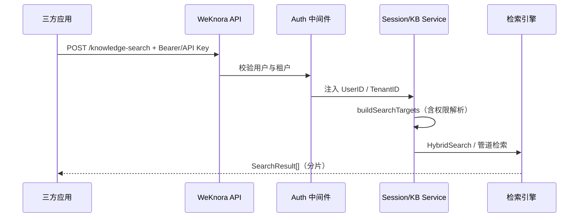
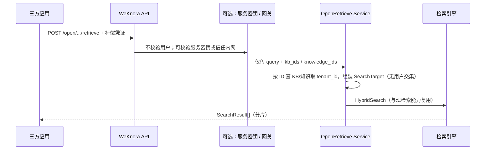

# 三方开放接口：知识库与检索需求设计

**文档版本**：1.2  
**日期**：2026-04-10  
**适用范围**：WeKnora 三方集成（目标1+目标2）

---

## 1. 目标定义

### 1.1 目标1（列表能力，登录态）

- 三方应用在登录态下获取当前用户可见知识库列表。
- 三方应用按知识库获取知识列表（文档/条目）。
- 用于前端选择检索范围、展示可用知识资产。

### 1.2 目标2（开放检索，无登录无归属校验）

- 三方应用通过 `knowledge_base_ids` 和/或 `knowledge_ids` + `query` 获取知识分片。
- 不需要用户登录校验。
- 不做用户归属/可见性校验（不走共享成员、共享 Agent、用户权限交集）。
- 允许跨租户资源检索（按资源真实 `tenant_id` 进行底层检索访问）。

---

## 2. 对接接口（精简版）

### 2.1 目标1：知识库列表接口（主接口）

#### `GET /api/v1/knowledge-bases/user`

**用途**：获取当前登录用户可见知识库列表（个人 + 加入共享），含角色与统计信息。  
**认证**：需要（Bearer / API Key，按现网）。  
**请求参数**：

| 参数 | 类型 | 必填 | 默认值 | 说明 |
|------|------|------|--------|------|
| `include_shared` | bool | 否 | `true` | 是否包含共享知识库 |

**响应示例（精简字段）**：

```json
{
  "success": true,
  "data": [
    {
      "id": "kb-001",
      "name": "产品知识库",
      "type": "document",
      "visibility": "private",
      "is_owner": true,
      "member_role": "admin",
      "knowledge_count": 120,
      "chunk_count": 3450
    },
    {
      "id": "kb-101",
      "name": "售后 FAQ",
      "type": "faq",
      "visibility": "shared",
      "is_owner": false,
      "member_role": "viewer",
      "knowledge_count": 0,
      "chunk_count": 860
    }
  ]
}
```

**错误码建议**：

- `401`：未认证或认证失效
- `403`：无访问权限
- `500`：服务内部错误

---

### 2.2 目标1：知识列表接口

#### `GET /api/v1/knowledge-bases/{kb_id}/knowledge`

**用途**：获取指定知识库下知识列表。  
**认证**：需要。  
**说明**：权限语义保持现有实现（用户可见范围）。

---

### 2.3 目标2：开放检索接口（新增）

#### `POST /api/v1/open/knowledge/retrieve`（建议路径）

**用途**：无登录态条件下直接检索知识分片，供外部模型上下文拼接。  
**认证**：不走用户登录；建议服务级控制（网关密钥 / mTLS / 内网白名单）。  
**请求体**：

| 字段 | 类型 | 必填 | 说明 |
|------|------|------|------|
| `query` | string | 是 | 用户问题 |
| `knowledge_base_ids` | string[] | 否 | 目标知识库 ID 列表 |
| `knowledge_ids` | string[] | 否 | 目标知识 ID 列表 |
| `match_count` | int | 否 | 返回条数上限（可选） |

> 约束：`knowledge_base_ids` 与 `knowledge_ids` 至少一个非空。

**请求示例**：

```json
{
  "query": "合同退款规则是什么",
  "knowledge_base_ids": ["kb-001", "kb-101"],
  "knowledge_ids": ["doc-88"]
}
```

**响应示例（精简字段）**：

```json
{
  "success": true,
  "data": [
    {
      "knowledge_base_id": "kb-001",
      "knowledge_id": "doc-88",
      "content": "......",
      "score": 0.92,
      "match_type": "embedding"
    }
  ]
}
```

---

## 3. 设计原则

- 目标1与目标2分离：一个是用户可见性接口，一个是开放检索接口。
- 目标2单独 Service：避免复用登录态权限分支导致语义偏差。
- 检索内核复用：向量检索、关键词检索、融合逻辑复用现有能力。
- 安全边界前移：目标2依赖部署与服务级控制，不依赖用户鉴权。

---

## 4. 目标2技术设计（单独 Service）

### 4.1 新增组件

- `OpenRetrieveHandler`
- `OpenRetrieveService`
- `OpenRetrieveTargetBuilder`
- `OpenRetrieveAuthMiddleware`（可选，仅服务级）

### 4.2 调用流程

1. 接收 `query + knowledge_base_ids/knowledge_ids`。
2. 基础参数校验（空值、长度、上限）。
3. `OpenRetrieveTargetBuilder` 按 ID 直查资源：
   - KB：`GetKnowledgeBaseByID`
   - Knowledge：`GetKnowledgeByIDOnly`
4. 从资源记录提取真实 `tenant_id`，组装检索目标（不做用户权限交集）。
5. 按嵌入模型分组调用 `HybridSearch` 或统一检索管道。
6. 合并、去重、排序，返回分片结果。

### 4.3 严格约束

- 不调用 `validateKnowledgeBaseAccess`。
- 不调用 `CheckUserKBPermission`。
- 不调用 `GetKnowledgeBatchWithSharedAccess`。
- 不依赖请求中的用户身份上下文。

---

## 5. 实施清单（研发，细化）

### P0：接口与代码落地

- [ ] 新增路由：`POST /api/v1/open/knowledge/retrieve`
- [ ] 路由挂载策略确定：
  - [ ] 方案A：挂在全局 `Auth` 前
  - [ ] 方案B：独立分组并跳过 JWT 中间件
- [ ] 新增 `OpenRetrieveHandler`（参数校验、错误码统一）
- [ ] 新增 `OpenRetrieveService`（独立于 `sessionService.SearchKnowledge`）
- [ ] 新增 `buildOpenSearchTargets(kbIDs, knowledgeIDs)`：
  - [ ] 仅主键查询资源
  - [ ] 提取真实 `tenant_id`
  - [ ] 构建目标并去重
- [ ] 复用检索内核（`HybridSearch` / pipeline）并补齐类型兼容（document/faq）

### P0：安全与治理（目标2必做）

- [ ] 配置开关：`open_retrieve_enabled`
- [ ] 服务密钥：`open_retrieve_secret`（Header 校验）
- [ ] 限流：按调用方标识 / IP / 全局 QPS
- [ ] 审计日志：记录 request_id、调用方标识、目标 KB/Knowledge 数量、耗时
- [ ] 灰度策略：按环境和租户开关

### P1：接口文档与测试

- [ ] 新增 `docs/api/open-knowledge-retrieve.md`
- [ ] 在 `docs/api/README.md` 增加目录入口
- [ ] 补 OpenAPI（swagger）定义：request/response/error
- [ ] 单元测试：
  - [ ] 参数校验
  - [ ] 仅 KB 检索
  - [ ] 仅 Knowledge 检索
  - [ ] KB+Knowledge 混合检索
  - [ ] 无登录上下文调用
- [ ] 集成测试：
  - [ ] 多租户资源混合
  - [ ] FAQ 与文档混合
  - [ ] 限流与密钥失效场景

### P2：优化项

- [ ] `match_count`、`vector_threshold` 等参数按租户/调用方可配置
- [ ] 结果缓存（短 TTL）与热点问题优化
- [ ] 失败重试与熔断策略（外部向量模型异常）

---

## 6. 发布验收标准

- 目标1：`/api/v1/knowledge-bases/user` 对三方可稳定提供可见知识库列表。
- 目标2：无需用户登录即可检索到指定资源分片，且不执行用户归属校验。
- 安全：服务级控制、限流、审计全部生效。
- 文档：接口文档、示例、错误码、测试说明齐全。

---

## 7. 关联代码（现状参考）

- 路由：`internal/router/router.go`
- 登录态检索入口：`internal/handler/session/qa.go`
- 登录态目标构建：`internal/application/service/session_knowledge_qa.go`
- 混合检索：`internal/application/service/knowledgebase_search.go`
- 搜索类型：`internal/types/search.go`

---

**文档结束**
# 三方应用知识库开放能力 — 需求分析与设计方案

**文档版本**：1.1  
**日期**：2026-04-10（v1.1 修订目的2安全边界）  
**依据代码库**：WeKnora（`internal/handler`、`internal/application/service`、`internal/router`）

---

## 1. 背景与目标

### 1.1 业务目标一：可发现性

**需求**：三方应用在用户已登录（或等价身份已识别）的前提下，通过 HTTP 接口获取：

- 当前主体**可见的知识库列表**；
- 指定知识库下的**知识（文档/条目）列表**。

**价值**：供三方 UI 做知识源选择、配置 RAG 范围、展示文档元数据等。

### 1.2 业务目标二：面向模型调用的检索（开放检索）

**需求**：三方应用通过以下**任一或组合**方式，并携带**问题（查询文本）**，获取**知识分片（chunk）**结果，供外部大模型使用：

- 指定**知识库 ID 列表**（整库检索）；和/或  
- 指定**知识 ID 列表**（限定到具体文档/知识条目内检索）。

**与目标一的本质区别（硬性要求）**：

| 维度 | 目标一（列表） | 目标二（检索） |
|------|----------------|----------------|
| 用户登录 | **需要**（或等价主体识别） | **不需要** |
| 归属 / 可见性校验 | **需要**（仅能列自己可见的库与知识） | **不需要**（不按「当前用户能否访问该 KB/知识」过滤） |

**语义说明**：调用方只要提供合法的 `knowledge_base_id(s)` / `knowledge_ids`（在系统内存在即可），服务端**直接**按资源自身记录的租户与存储定位数据并执行向量/关键词检索，**不**执行 `validateKnowledgeBaseAccess`、共享成员、共享 Agent 等与「用户—资源」关系相关的校验。

**重要风险与产品前提**：  
知晓任意 KB ID / 知识 ID 的调用方即可拉取对应内容分片，属于**数据外泄面扩大**。除非部署在**可信网络**（如内网、专线）或由**网关层**统一收口，否则必须在实现上增加**补偿控制**（见第 4.5 节），例如：独立「检索服务密钥」、IP 白名单、限流与审计；**不建议**在公网零防护开放。

**技术备注**：检索仍须使用各知识库真实的 `tenant_id` 连接向量库与业务库（数据行自带归属），只是**不再与用户身份做交集判断**。

---

## 2. 现状盘点（与项目实现对齐）

### 2.1 认证与租户上下文

- 业务 API 位于 `GET|POST /api/v1/...`，经 `middleware.Auth` 校验。
- 常见方式：`Authorization: Bearer <JWT>` 或 `X-API-Key`（及租户相关的 `X-Tenant-ID` 等，以实际部署配置为准）。
- **结论**：三方应用与控制台/前端使用**同一套认证**即可代表「当前登录用户」；无需单独「开放网关用户」即可满足多数场景（若需应用级凭证，可后续单独设计 OAuth2 Client 或 Scoped API Key）。

### 2.2 知识库列表（目标一 · 部分已满足）

| 能力 | 方法 | 路径 | 实现要点 |
|------|------|------|----------|
| 列表（含共享等） | GET | `/api/v1/knowledge-bases` | `ListKnowledgeBases` → `SharedKnowledgeBaseService.ListUserKnowledgeBases`，与前台「我的 + 共享」语义一致；支持 `agent_id` 时走共享 Agent 可见 KB 子集 |
| 用户视角增强列表 | GET | `/api/v1/knowledge-bases/user` | 附带 `is_owner`、`member_role`、统计字段等 |

**设计建议**：三方若只需 ID/名称/类型，优先 **GET `/knowledge-bases`**；若需成员角色与统计，用 **GET `/knowledge-bases/user`**。

### 2.3 知识列表（目标一 · 已满足）

| 能力 | 方法 | 路径 | 说明 |
|------|------|------|------|
| 某库下知识分页列表 | GET | `/api/v1/knowledge-bases/:id/knowledge` | `KnowledgeHandler.ListKnowledge`，路径参数 `:id` 为知识库 ID |

**权限**：与现有 `validateKnowledgeBaseAccess` 一致（本租户、组织共享、直接共享成员、共享 Agent 等链路）。

### 2.4 分片检索 / 混合检索

#### 2.4.1 与「目标二」的关系（**未满足** v1.1 定义下的目标二）

现有接口均在 **`middleware.Auth` 之后**，且检索链路依赖 **用户 + 租户上下文** 与 **`buildSearchTargets` 内的共享/成员类解析**，属于**已登录 + 归属/可见性语义**，**不符合**第 1.2 节「无登录、无归属校验」的开放检索要求。要实现目标二需 **新增独立路由与 Service 路径**（见第 4.5、第 5 节）。

#### 2.4.2 现有能力（登录态 + 权限语义，供对比与目标一共存）

**接口（无需 LLM、直接返回 chunk 列表）**：

| 能力 | 方法 | 路径 | 请求体 |
|------|------|------|--------|
| 统一知识检索 | POST | `/api/v1/knowledge-search` | 见下表 |

**请求体类型**（`internal/handler/session/types.go` — `SearchKnowledgeRequest`）：

| 字段 | 类型 | 必填 | 说明 |
|------|------|------|------|
| `query` | string | 是 | 用户问题 / 检索查询文本 |
| `knowledge_base_id` | string | 否 | 单库 ID，与 `knowledge_base_ids` 二选一或组合 |
| `knowledge_base_ids` | string[] | 否 | 多库整库检索 |
| `knowledge_ids` | string[] | 否 | 限定到具体知识（文档） |

**校验规则（已实现）**：`knowledge_base_id(s)` 与 `knowledge_ids` **至少其一非空**。

**内部实现**（`sessionService.SearchKnowledge` → `buildSearchTargets`）：

- 对 `knowledge_base_ids`：构建「整库」检索目标，并解析每个 KB 相对**当前用户**的**有效租户**（含组织共享、直接共享成员等）。
- 对 `knowledge_ids`：经 `GetKnowledgeBatchWithSharedAccess` 等路径，**仅返回当前用户有权访问的知识**。

**检索管道**：`PluginSearch` → `HybridSearch`，返回 `types.SearchResult`。

**备选**：`GET /api/v1/knowledge-bases/:id/hybrid-search` + JSON Body（路由为 GET 与 JSON Body 并存疑，集成时建议核对）。

### 2.5 FAQ 型知识库

- 文档型知识：上述检索覆盖。
- FAQ 型：条目管理在 `/api/v1/knowledge-bases/:id/faq/*`，检索另有 `POST .../faq/search`。若三方混合文档库与 FAQ 库，需在**产品层**区分类型或分别调用 FAQ 检索接口。

---

## 3. 需求与现状差距（Gap）

| 需求点 | 现状 | 建议 |
|--------|------|------|
| **目标二：无登录、无归属校验的检索** | **不存在**；`/knowledge-search` 等在 Auth 之后且做用户可见性过滤 | **新增**例如 `POST /api/v1/open/knowledge/retrieve`（路径可定），注册在 **Auth 之前** 或仅用**服务级密钥**中间件；内部按 ID 查库得到 `tenant_id` 后直接组 `SearchTarget` 调现有 `HybridSearch` 管道，**跳过**用户权限分支 |
| 三方专用「最小字段」OpenAPI | 与控制台共用 Swagger，字段较多 | 对开放检索单独暴露精简 OpenAPI，并标注安全前提 |
| 仅知识 ID、无 KB ID | 登录态接口已支持仅 `knowledge_ids` | 开放检索同样支持；无效 ID 跳过或返回明确错误码（产品定） |
| 跨多 KB 且嵌入模型不一致 | `HybridSearch` 按嵌入模型分组 | 与现 pipeline 一致；文档说明限制 |
| 限流、审计 | 需确认网关/配置 | **开放检索为必配**：全局限流 + 按调用方标识审计 |
| GET + JSON Body | `hybrid-search` 注册为 GET | 开放检索统一用 POST + JSON |

---

## 4. 设计方案（集成架构）

### 4.1 目标一：逻辑架构（需登录 + 归属校验）



### 4.2 目标二：逻辑架构（无用户登录、无归属校验）



### 4.3 推荐调用顺序（三方）

**场景 A — 仅需要目标二（开放检索）**  

1. **不**走用户登录。  
2. 按部署约定携带 **服务级凭证**（若启用）或仅在内网调用。  
3. 调用待实现的 **`POST /api/v1/open/knowledge/retrieve`**（示例路径），body 与下节「检索 body」相同（`query` + `knowledge_base_ids` 和/或 `knowledge_ids`）。

**场景 B — 目标一 + 登录态检索（与现网一致）**  

1. **登录**：Token 或租户 API Key。  
2. **列举知识库**：`GET /api/v1/knowledge-bases`（或 `/knowledge-bases/user`）。  
3. **列举知识**（可选）：`GET /api/v1/knowledge-bases/{kb_id}/knowledge`。  
4. **检索分片**：`POST /api/v1/knowledge-search`，body 示例：

```json
{
  "query": "用户自然语言问题",
  "knowledge_base_ids": ["kb-a", "kb-b"],
  "knowledge_ids": ["doc-1", "doc-2"]
}
```

仅整库：

```json
{
  "query": "问题",
  "knowledge_base_ids": ["kb-a"]
}
```

仅文档（不限定传 KB ID）：

```json
{
  "query": "问题",
  "knowledge_ids": ["doc-1"]
}
```

### 4.4 安全与权限（分场景）

**目标一（列表与登录态检索）**  

- 结果必须在**当前用户可见**范围内；防越权依赖现有 `CheckUserKBPermission`、`GetKnowledgeBatchWithSharedAccess`、共享 Agent 等。  
- 响应**不应**包含存储密钥或内部凭证。

**目标二（开放检索）**  

- **不做**用户级鉴权与资源级归属校验；安全边界前移到：**网络隔离**、**服务密钥 / mTLS**、**反向代理白名单**、**强限流与全量审计**。  
- 产品需接受：持有有效调用能力 + 猜测/泄露的 ID 即可读取分片内容。  
- 若未来需「仍不登录但限定某些 KB」，应改为**白名单配置**（服务端配置允许检索的 `knowledge_base_id` 集合），仍不属于「按用户归属校验」，而是**按部署策略校验**。

### 4.5 目标二实现要点（研发）

1. **路由**：新建 `POST /api/v1/open/knowledge/retrieve`（或统一前缀 `/api/v1/integration/...`），挂在 **全局 `Auth` 之前**；或使用独立子域 + 仅该路由跳过 JWT。  
2. **上下文**：不注入真实 `UserID`；对每个目标 KB/知识从 **DB 读取其 `tenant_id`**，`context` 使用 `WithValue(TenantIDContextKey, 资源所属租户)` 调用现有 `HybridSearch` / `PluginSearch` 所需接口。  
3. **禁止复用** `buildSearchTargets` 中带 `CheckUserKBPermission` / `GetKnowledgeBatchWithSharedAccess` 的分支，应新增 **`buildOpenSearchTargets(ctx, kbIDs, knowledgeIDs)`**：仅 `GetKnowledgeBaseByID`、`GetKnowledgeByIDOnly` 等**按主键加载**，不存在则跳过或 404。  
4. **补偿控制（建议必做）**：配置项如 `open_retrieve_enabled`、`open_retrieve_secret`（Header 校验）、`allowed_knowledge_base_ids`（可选全局白名单）、每分钟 QPS 上限。  
5. **FAQ 库**：与文档库相同原则，按 KB `type` 走现有 FAQ 检索分支或单独参数区分。

### 4.6 非功能需求建议

- **超时**：检索链路涉及向量与可能的重排，建议客户端超时 ≥ 60s（按实际部署调优）。  
- **分页**：列表接口遵循现有 `page` / `page_size`；检索接口以 `match_count`（在租户 `RetrievalConfig` 与管道默认值中体现）控制条数，必要时在后续版本增加显式参数暴露给 HTTP。  
- **幂等**：检索只读，可重复调用。

---

## 5. 实施清单（研发）

| 优先级 | 项 | 说明 |
|--------|----|------|
| **P0** | **开放检索 API（目标二）** | 新路由 + `buildOpenSearchTargets` + 服务密钥/开关/限流；**不得**简单转发到现有 `knowledge-search`（否则仍受登录与归属约束） |
| P0 | 对外文档 | 本文档与 `docs/api/*` 互链；明确区分「登录检索」与「开放检索」 |
| P1 | 修正 `hybrid-search` 方法与文档一致 | GET/POST 与 Body 统一 |
| P2 | FAQ 与文档库在开放检索中混合 | 按 KB 类型组批或文档约定 |

---

## 6. 附录：关键代码索引

- 路由：`internal/router/router.go` — `knowledge-search`、`knowledge-bases`、`knowledge-bases/:id/knowledge`  
- 检索入口：`internal/handler/session/qa.go` — `SearchKnowledge`  
- 目标构建与检索：`internal/application/service/session_knowledge_qa.go` — `SearchKnowledge`、`buildSearchTargets`  
- 混合检索：`internal/application/service/knowledgebase_search.go` — `HybridSearch`  
- 搜索参数：`internal/types/search.go` — `SearchParams`、`SearchResult`  
- 知识库访问校验：`internal/handler/knowledgebase.go` — `validateAndGetKnowledgeBase`；`internal/handler/knowledge.go` — `validateKnowledgeBaseAccessWithKBID`

---

**文档结束**
